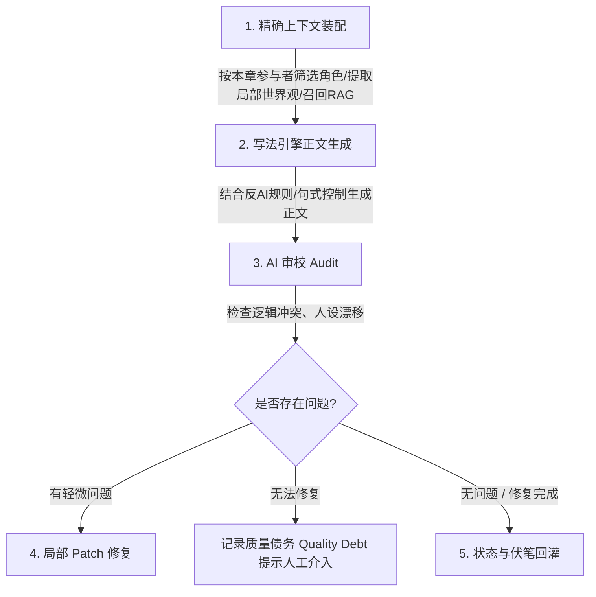

Listed directory novel

这个项目设计“创作一部小说”的核心理念是：**“像专业电影导演流水线一样，把写小说拆解为宏观规划、微观拆分、单章生产、审校修复与状态回灌 5 大步骤”**。

传统 AI 工具是“你写一句，AI 接一句”，长篇容易失控崩溃；而本项目的设计是 **递进式控制链 (Progressive Control Pipeline)**，具体分为以下 5 个核心阶段：

---

### 1. 第一步：灵感开书与立项 (Book Framing & Pitch)
*不要直接开写正文，先确定“这本书要写成什么样”。*

```
[用户输入1句灵感] 
       ↓
[AI 自动导演 Auto-Director] 
       ↓
[生成 3 套整本方向 + 推荐书名组] 
       ↓
[锁定 Book Framing (题材 / 卖点 / 目标读者感受 / 前30章承诺)]
```
- **关键设计**：防止用户盲目开写导致后半段崩盘。AI 会先帮用户立项，锁定小说最核心的卖点与立意。

---

### 2. 第二步：宏观规划与资源搭建 (World & Characters)
*在写任何章节之前，先建立小说资产库。*

- **故事宏观规划 (Story Macro)**：确定全书的总字数、分卷战略、主线冲突与终局设计。
- **本书世界 (World Building)**：设定世界观规则、力量体系、势力图谱和地理地图。
- **角色名册 (Character Ledger)**：建立主角/配角档案，区分已确认角色与待确认动态提案（避免 AI 随手乱添新角色）。

---

### 3. 第三步：分卷战略与细化拆章 (Volume & Chapter Breakdown)
*将百万字大纲拆解为每一个具体执行的章节任务。*

- **卷骨架 (Volume Skeleton)**：把全书划分为若干卷（如：第一卷·崛起篇，第二卷·宗门篇），规划每卷的起承转合。
- **节奏板 (Pacing Board)**：设计每一卷的情感起伏与爽点/悬念分布。
- **细化大纲 (Chapter Outlines)**：把每一章拆解为：**本章目标、参与角色、场景地点、核心冲突、本章留下的悬念**。

---

### 4. 第四步：单章生产主链 (Chapter Execution Chain)
*真正生成正文时的自动化流水线（代码位于 [server/src/services/novel/production](file:///d:/00%E8%87%AA%E5%AA%92%E4%BD%93%E5%88%9B%E4%B8%9A/AI-Novel-Writing-Assistant/server/src/services/novel/production)）。*

每写一章，系统都会自动走完下面 5 个严密步骤：



1. **精确上下文装配 (Context Assembly)**：绝不把全书几万字的资料直接塞进 Prompt！而是根据本章大纲，**只动态装配**本章用到的角色、当前场景和 RAG 召回的相关设定。
2. **结合写法引擎生成正文 (Generation)**：注入反 AI 表达规则（减少空洞感叹、套话总结），按照作者绑定的笔风特征输出正文。
3. **AI 审校 (Audit)**：检查正文是否违背了角色设定、是否漏掉了大纲要求。
4. **智能 Patch 修复 (Repair)**：若发现局部问题，只对有问题的段落进行精准 Patch，而不是简单地全篇重写。
5. **伏笔与事实回灌 (Backfill)**：提取本章实际写出的新信息（如：角色受了伤、拿到了某道具、留下了某悬念），写回数据库。

---

### 5. 第五步：全自动驾驶与跟进交接 (Auto-Director & Recovery)

- **全自动模式**：系统可以开启全自动“挂机写作”，按顺序自动写完全书章节。
- **安全熔断与断点恢复**：如果遇到模型额度耗尽、连续修复失败或需要重新规划，AI 会生成 **Checkpoints（恢复检查点）** 并弹出提示让作者接管，不会盲目死循环。

---

### 🎯 总结：设计理念对照表

| 传统 AI 写作方式 | 本项目 (AI Novel Production Engine) |
| :--- | :--- |
| **写作方式** | 一问一答、单段补全 | 导演式流水线、全书递进生成 |
| **上下文管理** | 扔整本书或前文所有对话（易超 Token、易混淆） | 角色资源账本 + 按章精确动态装配 + RAG |
| **一致性控制** | 靠运气，写到后面人物性格/战力易坍塌 | 动态状态回灌 + 伏笔账本 + 审校修复链 |
| **失败处理** | 生成不满意就整个重写 | 局部段落 Patch 修复 + 质量债务记录 + 断点恢复 |


